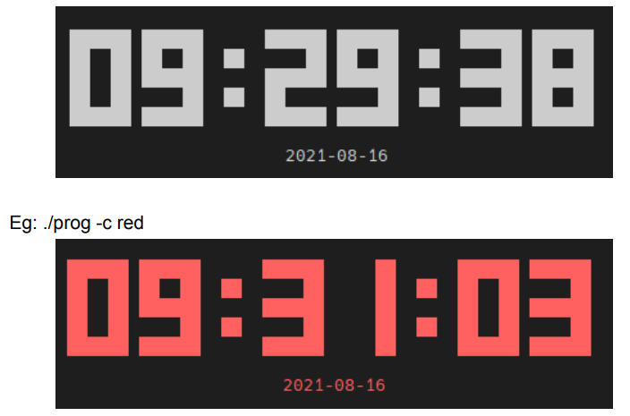

## Digital-clock

The development of a digital clock that prints the current time, and date on the linux
terminal. If a color is given as an argument to the program, the program should be able to
print a colored output. 

